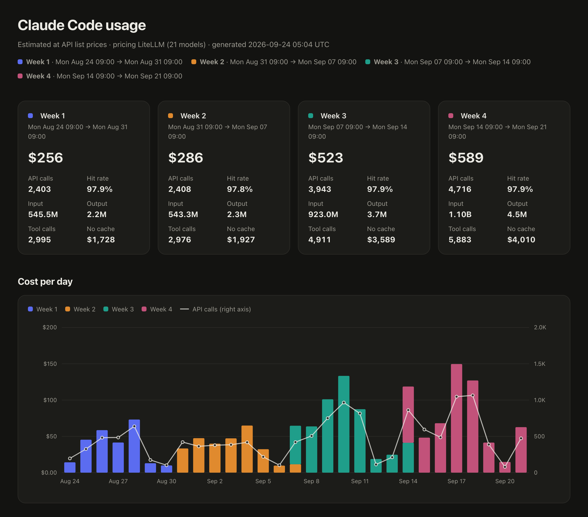
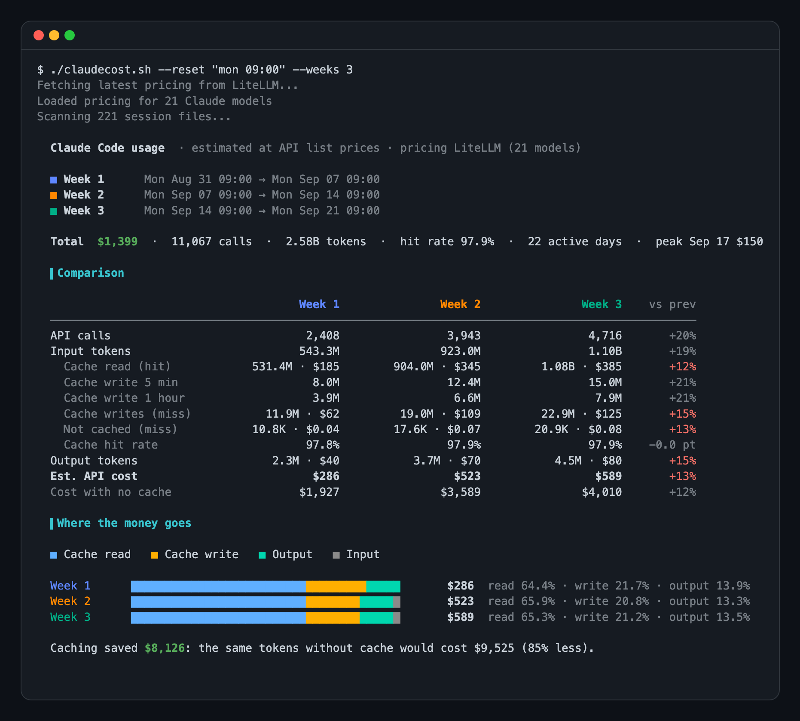
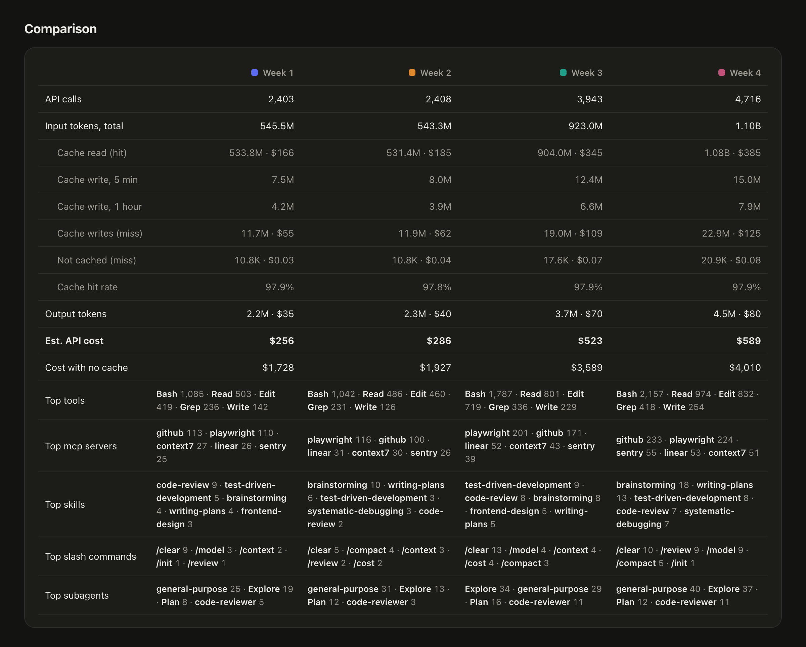
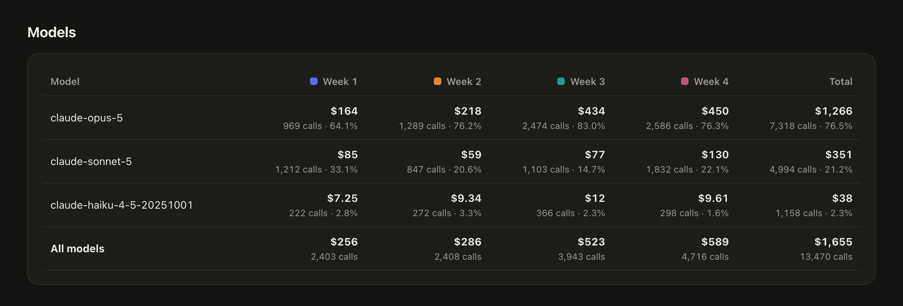
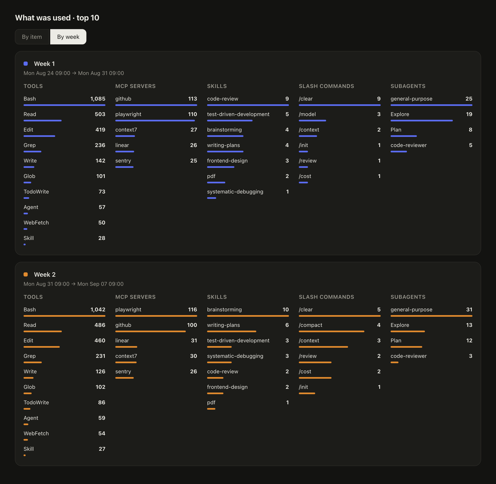

<div align="center">

# 💸 claude-stats

**See what your Claude Code usage would cost — and where every token goes.**

Tokens · cache hits and misses · models · projects · tools · MCP servers · skills · slash commands<br>
Compare days, weeks (your Pro/Max quota week too), months or years — in the terminal or as an HTML report.


[](https://github.com/sushantgundla/claude-stats/actions/workflows/test.yml)


<table>
<tr>
<td width="55%"></td>
<td width="45%"></td>
</tr>
<tr>
<td align="center"><sub>HTML report (<code>--html</code>)</sub></td>
<td align="center"><sub>Terminal</sub></td>
</tr>
</table>

<details>
<summary><b>📸 More screenshots</b></summary>
<br>
<table>
<tr>
<td></td>
<td></td>
<td></td>
</tr>
<tr>
<td align="center"><sub>Comparison</sub></td>
<td align="center"><sub>Models per week</sub></td>
<td align="center"><sub>Top 10, by week</sub></td>
</tr>
</table>
<sub>Screenshots use generated demo data.</sub>
</details>

</div>

One script per system, same features and same output. Nothing to install. Everything stays on your machine.

| You use | Script | Runs in |
| --- | --- | --- |
| macOS or Linux | `claude-stats.sh` | Terminal (bash) |
| Windows | `claude-stats.ps1` | PowerShell (the one that comes with Windows, or PowerShell 7) |

`claude-stats.ps1` also runs on macOS and Linux if you have [PowerShell 7](https://github.com/PowerShell/PowerShell) (`pwsh`).

## 🚀 Install

**macOS or Linux**

```bash
curl -O https://raw.githubusercontent.com/sushantgundla/claude-stats/main/claude-stats.sh
chmod +x claude-stats.sh
```

**Windows** (PowerShell)

```powershell
Invoke-WebRequest https://raw.githubusercontent.com/sushantgundla/claude-stats/main/claude-stats.ps1 -OutFile claude-stats.ps1
```

If Windows says running scripts is disabled, run it like this once (nothing is changed on your system):
`powershell -ExecutionPolicy Bypass -File .\claude-stats.ps1 -Days 7`

## ⚡ Quick start

**macOS or Linux**

```bash
./claude-stats.sh --days 7                        # the last 7 days
./claude-stats.sh --reset "wed 23:30" --weeks 2   # your last 2 quota weeks, side by side
./claude-stats.sh --reset "wed 23:30" --html report.html && open report.html
```

**Windows** (PowerShell)

```powershell
.\claude-stats.ps1 -Days 7                        # the last 7 days
.\claude-stats.ps1 -Reset "wed 23:30" -Weeks 2    # your last 2 quota weeks, side by side
.\claude-stats.ps1 -Reset "wed 23:30" -Html report.html; start report.html
```

`--reset` / `-Reset` is the weekday and local time your weekly limit resets. Find it on
claude.ai under **Settings → Usage**.

### Same options, two spellings

Every option works in both scripts. On Windows write it PowerShell-style (`-Days 7`). The
bash spelling (`--days 7`) also works in `claude-stats.ps1`, so the examples below run on both.

| bash (`claude-stats.sh`) | PowerShell (`claude-stats.ps1`) |
| --- | --- |
| `--days 7` | `-Days 7` |
| `--since 2026-09-01 --until 2026-09-07` | `-Since 2026-09-01 -Until 2026-09-07` |
| `--month 2026-08` | `-Month 2026-08` |
| `--reset "wed 23:30" --weeks 4 --current` | `-Reset "wed 23:30" -Weeks 4 -Current` |
| `--compare week --last 3` | `-Compare week -Last 3` |
| `--html report.html` | `-Html report.html` |
| `--top 20` `--project app` `--dir PATH` | `-Top 20` `-Project app` `-Dir PATH` |
| `--freq daily` `--offline` `--help` | `-Freq daily` `-Offline` `-Help` |

## 🧭 Commands

The tables use the bash spelling. On Windows use `.\claude-stats.ps1` and the PowerShell
spelling from the table above (or keep the bash one).

### One time range

| Command | Shows |
| --- | --- |
| `./claude-stats.sh` | All history |
| `./claude-stats.sh --days 7` | Last 7 days |
| `./claude-stats.sh --since 2026-09-01 --until 2026-09-07` | Those dates (`--until` is inclusive) |
| `./claude-stats.sh --since "2026-09-16 11:30" --until "2026-09-23 11:30"` | Exact times |
| `./claude-stats.sh --month 2026-08` | One calendar month |

### Compare periods (up to 5)

| Command | Compares |
| --- | --- |
| `./claude-stats.sh --reset "wed 23:30" --weeks 4` | Your last 4 quota weeks |
| `./claude-stats.sh --compare day --last 5` | The last 5 days |
| `./claude-stats.sh --compare week --last 3` | The last 3 calendar weeks (Monday 00:00) |
| `./claude-stats.sh --compare month --last 4 --current` | The last 4 months, plus this month so far |
| `./claude-stats.sh --compare year --last 2 --current` | The last 2 years, plus this year so far |

- `--last N` counts complete periods; `--current` adds the one in progress. 5 at most.
- The cost chart goes one step finer than what you compare: years by month, months by
  week, weeks by day, days by hour. Change it with `--freq hourly|daily|weekly|monthly`.

### Other options

| Option | Does |
| --- | --- |
| `--html FILE` | Also write a self-contained HTML report (no internet needed to view it) |
| `--top N` | Rows in the tools, MCP, skills and commands lists (default 10) |
| `--project NAME` | Only projects whose folder name contains `NAME` |
| `--dir PATH` | Read logs from another folder (default `~/.claude/projects`) |
| `--offline` | Use built-in prices instead of downloading the latest |
| `--help` | All options |

## 📊 What you get

**In the terminal**: the comparison with a change column, where the money goes (cache
read, cache write, output, input), a cost chart, a models table, and the top tools, MCP
servers, skills, slash commands and subagents for each period.

**In the HTML report** (`--html` / `-Html`). Every section folds away with a click, and every
chart has a one-line description in plain words.

- A card per period and the comparison table, with numbers colored green, blue or red so
  problems stand out (hover for the reason)
- Where the money goes, and a cache read vs write view with the hit rate over time
- Context size: how big the conversation is on each call, how it grows during a session,
  how long sessions run, as easy-to-read cumulative charts
- Models: a cost split per period and one row per model
- Requests and cost: per day, by hour of the day, by day of the week, and per project
- Top lists of tools, MCP servers and MCP tools, Bash commands (first word), files read,
  skills, slash commands, subagents and projects, by item or by week
- Light and dark mode, works offline, easy to share as a single file

## 🧮 What the numbers mean

- **Cache read (hit)**: conversation already in the cache. About 0.1x the input price.
- **Cache write (miss)**: new content stored in the cache, 1.25x input for 5 minutes or 2x
  for 1 hour (Claude Code's default).
- **Not cached**: plain input at 1x. **Output** is never cached.
- Every step of a session re-sends the whole conversation, mostly from cache, so cache
  reads are usually the biggest cost.
- Costs are **API list-price estimates**, not a Pro or Max bill. Subscription limits are
  measured differently.

## 🔁 How it counts

Claude Code logs a reply once per streamed block, and resumed or forked sessions copy old
messages into new files, often with new timestamps. claude-stats counts each thing once:

- API calls by message id, tool and MCP calls by `tool_use` id, slash commands by message id
- For a call logged several times, the largest token count wins (early lines are partial)
- Each item is placed at its earliest timestamp, so a copied message never counts as new

The report ends with a small table showing how many log lines became how many unique
items. Because of this, totals can be lower than tools that count every line.

Prices come from [LiteLLM](https://github.com/BerriAI/litellm) on every run (`--offline`
uses built-in prices). Models without a known price are marked `*` and priced like Sonnet.

## 🏎️ Speed

`claude-stats.sh`: a few seconds, even with months of logs (tested on a MacBook). Files are
read in parallel, and `perl` (on macOS and most Linux) pulls out just the fields needed.
Without perl it falls back to plain awk, about twice as slow.

`claude-stats.ps1` reads the files one after another. About 4 seconds for 270 MB of logs on
PowerShell 7; expect longer on Windows PowerShell 5.1 with several GB.

## ⚙️ Settings

| Variable | Effect |
| --- | --- |
| `NO_COLOR=1` | No colours (also off automatically when output is not a terminal) |
| `FORCE_COLOR=1` | Keep colours when piping, e.g. `FORCE_COLOR=1 ./claude-stats.sh \| less -R` |
| `CLAUDE_DIR` | Same as `--dir` / `-Dir` |
| `CLAUDE_STATS_READER=awk` | Force the plain awk reader (`claude-stats.sh` only) |

On Windows set a variable for one run like this: `$env:NO_COLOR = "1"; .\claude-stats.ps1`

## 📦 Requirements

- **macOS or Linux:** bash, awk, curl and perl, all included with most systems.
- **Windows:** PowerShell 5.1 (already on Windows 10 and 11) or PowerShell 7. Nothing else.

## 🧪 Tests

`tests/run-tests.sh` (bash) and `tests/run-tests.ps1` (PowerShell) run each script on a small
made-up log folder in `tests/fixtures` and check the numbers. A GitHub Actions workflow runs
both on Linux, macOS and Windows (Windows PowerShell 5.1 and PowerShell 7) on every push.

## 📄 License

MIT
